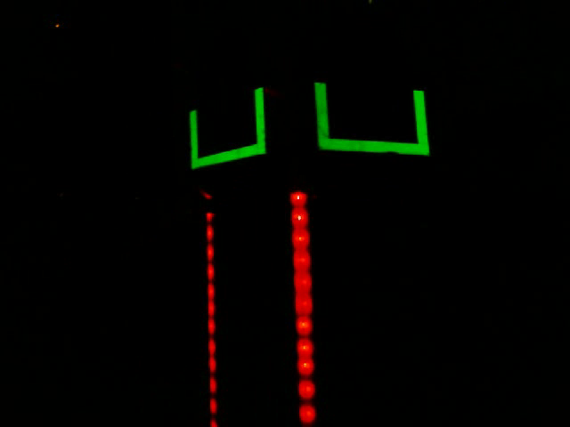

# Vision

In many FRC games, there are vision targets that we would like to align to, such as goals.
This documentation will cover our usual methods of doing so, both from a conceptual perspective
and specifically how to implement it with our [somewhat generic vision code](../muan/vision/).

## Physical Setup

In most FRC games that require vision, there are [retroreflective](https://en.wikipedia.org/wiki/Retroreflector)
vision targets on the goals. The retroreflective targets reflect light directly back to the
source of the light. This allows us to use a webcam with a very bright LED on it,
causing the retroreflective tape to be extremely bright in the resulting image.

Here's an example of what this can look like:

## Robot Setup

We choose to run our vision on a coprocessor (The NVIDIA Jetson) with a USB webcam.
The Jetson captures images from the USB Webcam, calculates the angle and distance to the goal
based on it's position in the image, and then sends the resulting angle and distance to the RoboRIO
in a message sent over UDP.

## Software

Conceptually, here are the steps that we take to get a good image and calculate the angle and distance from it:

### Set up USB Webcam settings.

We set the exposure and brightness as low as they will go. This is because there is a **lot**
of light coming in from the green LED, so a very low exposure allows us to only capture that light,
and almost none of the surrounding scene.
(You can see this in the example image above, where the majority of the image is completely black)

We only need to set up the webcam settings once, when the Jetson is turned on. This is done using
`v4l2ctrl -l`, as in [our 2017 vision startup script](../c2017/vision/coprocessor/startup.sh).
`v4l2ucp` is a nice(ish) GUI program used to adjust the settings by hand.
We use this to determine what the best settings are, then save them using `v4l2ctrl -s`.

[v4l2ctrl](http://manpages.ubuntu.com/manpages/zesty/man1/v4l2ctrl.1.html)
[v4l2ucp](http://manpages.ubuntu.com/manpages/zesty/man1/v4l2ucp.1.html)

### Get a frame from the webcam

Open the camera stream by calling `open` on a `cv::VideoCapture` object. To read frames,
create a `cv::Mat` (the class used to store images) and use `videocap >> mat`.
(The syntax for that is a bit weird, but you can think of it as a reverse `std::cout`)

[docs and example](http://docs.opencv.org/modules/highgui/doc/reading_and_writing_images_and_video.html#videocapture)

### Convert image to HSV

When images are stored by a computer, they are usually stored as three values for each pixel:
a red, green, and blue value. By combining red, green, and blue, any color that you see
on a computer screen can be created. However this representation (called "RGB") is
not always the most useful way to look at images.

Another common way to represent images is in "HSV" format - standing for Hue-Saturation-Value.
Hue is the color that's being represented - green, yellow, blue, orange, etc.
Saturation is how colorful it is. Value is how dark or light the color is.

A neat way to visualize the HSV colorspace is using the following image:

HSV usually works better for detecting colors, since instead of searching
for a specific red, green, and blue value, we can just say that we're looking for a value that's green,
with a specific saturation and lightness, similar to how humans think about colors. For retroreflective
targets there's so much contrast it doesn't matter much, but it can still be easier to think about in HSV.

To convert an image to HSV, use `cv::cvtColor`.

[docs](http://docs.opencv.org/2.4/modules/imgproc/doc/miscellaneous_transformations.html#cvtcolor)

### Dilate and erode

_Note that we sometimes skip this step, since it's computationally expensive, and we can often get good results without it_

Dilating an image means enlarging the light colored areas. Eroding, conversely, means enlarging dark areas.
Using both is essentially a method of removing small areas that differ in color from nearby areas, so that objects
that might be (incorrectly) identified as multiple objects blur into each other and removing extra pixels.
This can make the job of recognizing the shapes easier.

[docs](http://docs.opencv.org/2.4/modules/imgproc/doc/filtering.html#dilate)
[tutorial](http://docs.opencv.org/2.4/doc/tutorials/imgproc/erosion_dilatation/erosion_dilatation.html)

### HSV Threshold

The next step is to determine what pixels are likely to be a part of the target. We do this by
checking the HSV values of each pixel to see if it is in a certain range. For example, we might
say that the hue needs to be within the range 40-80 (a fairly wide range of green/yellow values),
the saturation within 90-255 (meaning that the green must be somewhat vivid to count),
and a value between 100-230 (not too dark but not too light). The result of a HSV threshold
is a boolean (true/false) value for each pixel, representing if it's in the range.
We use a function called `cv::inRange` to do this.
We often display this as a black and white image for debugging and tuning purposes.

[docs](http://docs.opencv.org/2.4/modules/imgproc/doc/miscellaneous_transformations.html#threshold)
[tutorial](http://docs.opencv.org/2.4/doc/tutorials/imgproc/threshold/threshold.html)

### Find contours

The next step is to find all of the blobs of pixels that are part of a single object.
Since the HSV thresholded image is already a black and white image, this is quite easy.
We use a function in OpenCV called `cv::findContours` to do this. We then look at all of the
contours in the image, and discard any of them that are clearly too small to be a target.
This is so that we don't waste CPU trying to use more difficult calculations to figure out
if a specific contour is the target if it's clearly not the correct size.

[docs](http://docs.opencv.org/2.4/modules/imgproc/doc/structural_analysis_and_shape_descriptors.html)
[tutorial](http://docs.opencv.org/2.4/doc/tutorials/imgproc/shapedescriptors/find_contours/find_contours.html)

We also use `boundingRect`, `contourArea`, and `convexHull` to reduce a contour to position,
size, and "fullness", a measure of how convex the shape is. See [Vision::Update](../muan/vision/vision.cpp)
for our implementation.

### Score possible targets

Next, we need to choose some way to determine which of the contours (assuming that there are multiple)
is the correct one. There are several things that this could be based on, and the best one will depend
on the specific target that you're attempting to recognize. This can range from detecting a
specific shape, to just choosing the target that's highest up on the image.

Warning - this is the hardest part by a significant margin. It can take a lot of testing
to find a solution that works well, so don't give up when it takes a while to get working.
If you have a solution that works well, or have discovered a problem, ***please*** write it down here.

* Filter by size, otherwise any sorting method will be broken by unfortunately shaped/placed noise.
  Filter by other characteristics as well if you need to. It should be rare to allow anything besides a target through,
  since methods of finding the best target generally only work on things that are targets.

* When finding the best target, it often works better to sort by the position it gives rather than how the shape looks.

* If the target consists of multiple contours, selecting the set of contours where each contour gives
  the closest position to what the other contours give worked very well. See the c2017 code for an example of this.

* If there are multiple possible targets, put a weight on the target that was selected in the previous iteration
  to prevent jumping between targets when either would work.

When testing your code:
* Does it work when the target is partially obscured?
* Does it ignore reflective things that aren't a target?
  * Even if the target isn't in the frame?
* Does it work in intense light or varying light? Anticipate playing in a sportsball stadium where
  direct sun can transition to shade during a match.
* And lots more. If you find something else that commonly turns up problems, write it down here.

### Calculate angle and distance

Now that we have a contour that we think is the target, we want to convert it into values that are useful
for the robot - the angle and distance to the target. Angle is always necessary to aim. Distance may or may
not be necessary depending on the game.

We assume that the angle to the target is linear to the position of the contour on the screen
([it's not, but that's not super important](https://www.chiefdelphi.com/forums/showpost.php?p=1571187&postcount=4)).

From that assumption, `angle_x = contour_x * field_of_view + camera_angle_x` (likewise for y)
and `distance = target_height_above_camera / tan (angle_y)`. `angle_x` is how far the robot is pointing
to the left of the target.

### Send to RoboRIO

We package up the angle into a message and send it over [UDP](https://www.howtogeek.com/190014/)
to the roboRIO, so that the robot can actually turn the correct angle.
We use [971's wrapper](../third_party/aos/vision/events/udp.h) for this.
This is done in a different thread from vision processing.

## Implementing with `muan::vision`

`muan::vision::Vision` handles converting an image to HSV, thesholding, finding contours,
and removing small contours in the function `Update`. It handles calculating distance
and angle as well. This leaves you to implement sending values (which is the same year to year)
reading frames, selecting the target, and saving information for debugging.

You can check out [our 2017 vision code](../c2017/vision/coprocessor) for an example of how this can be implemented.

## Tuning

There values that need to be tuned for vision to work correctly are generally:

* The camera proterties - that is, the field of view and offset, both horizontally and, if distance
      is necessary, vertically.
* The height of the target above the camera, if distance is necessary
* The HSV threshold values

### Camera properties

The [field of view](https://en.wikipedia.org/wiki/Field_of_view) will only need to be determined once per model of camera.
The offset will need to be determined every time the camera's angle is adjusted relative to the shooter angle
(generally when mechanical work is done on the robot requiring removing and reinstalling the camera mount/shooter/etc).
The horizontal offset is how far the shooter points to the left of the camera. The vertical offset if how far the camera
points above horizontal. A different config file is needed for each robot, store all of them.

**Horizontal field of view:** Log the x position of the target and the angle
from the gyro while slowly turning the robot in front of the goal. Then find the line of best fit
`angle_x = FOV_x * position_x + b`.

**Horizontal offset:** Manually align the robot so that it makes shots exactly in the middle
of the goal, then record the value that the vision is reporting. *Subtract* this value from the offset.

**Vertical field of view and offset** (not necessary unless you are using distance calculationts):
Slowly move the robot around and record the y position of the target and the real distance (use a tape measure).
Create a data series `angle_y := atan (height_difference / distance)`. Then find the line of best fit
`angle_y = FOV_y * position_y + offset_y`.

In the past, this has been located in a protobuf file called `robot_constants.pb`. However, this may change
from year to year. If you're having trouble finding it, look for the place where the `muan::vision::VisionConstants`
object is created in the coprocessor side robot code.

### HSV Thresholds

The HSV thresholds may need to be updated when lighting is significantly changed.

To determine the proper HSV thresholds, first take a video of the field using the same camera settings
and LED setup as is on the robot. This video should include:

* All of the goals on both sides of the field, from everywhere the robot will be shooting from
* Any lights on the field that may cause interference
* Any lights in the arena that may cause interference

As much as possible, try to take this from the point of view of the robot.

Once you have the video, start tuning the HSV thresholds. (There is a tool to assist doing this in
`//muan/vision:calibration\helper`) Start with all of the sliders at the range 0-255 (the maximum),
then slowly narrow them in until only the targets show up in the preview image. Err on the side of
making the range larger that necessary, since false positives are much easier to deal with than
false negatives are.

To run the calibration helper, run `bazel run //muan/vision:calibration_helper -- --mode=capture`
to capture the video. Once you've done that, `bazel run //muan/vision:calibration_helper -- --mode=tune`
will let you adjust parameters. Make sure to test that this works *before* the competition
*using that jetson and webcam that you will be using at competition,*
since there have been known to be compatibility issues.
